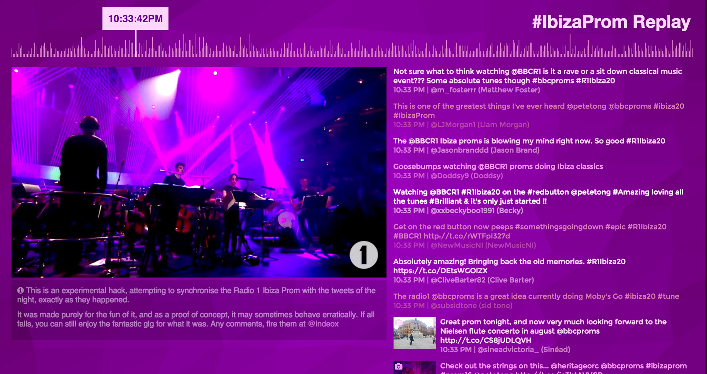

# Ibiza Prom Replay

This is an experimental React app, that syncs up BBC's Radio 1 [Ibiza Prom](https://www.youtube.com/watch?v=xs3BXVTF7mw) from the 29th of July 2015 to the colours in the video and the tweets published at the time of the gig.

To run:
`npm start`

Project is based off the [React seed](https://github.com/badsyntax/react-seed) boilerplate.

